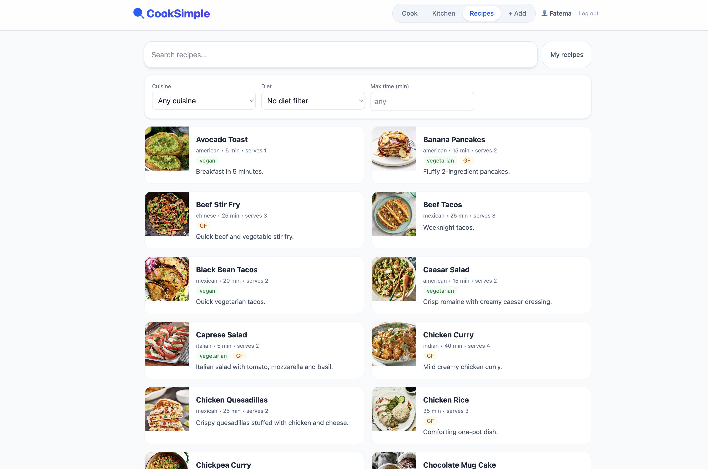
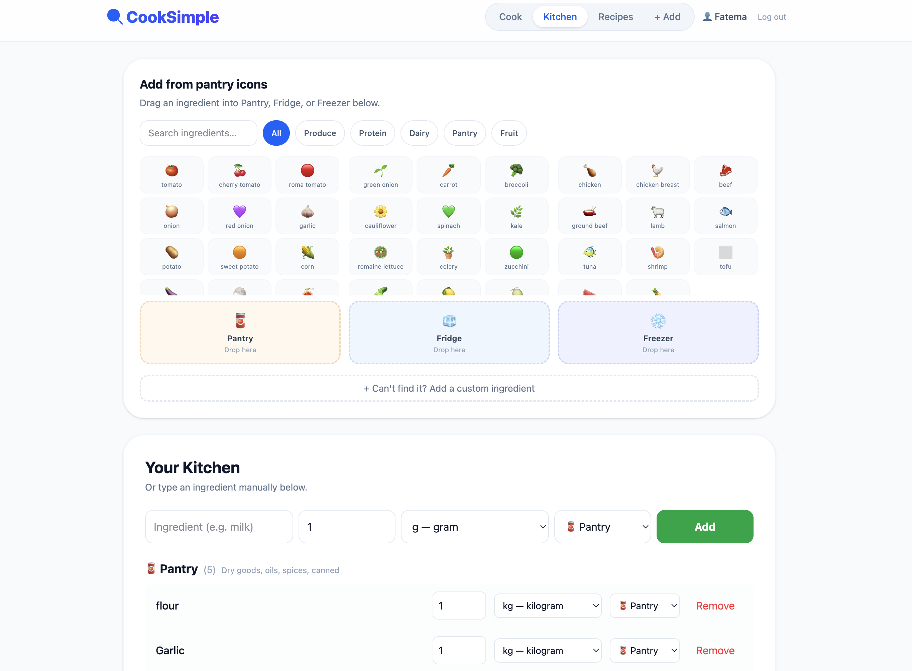
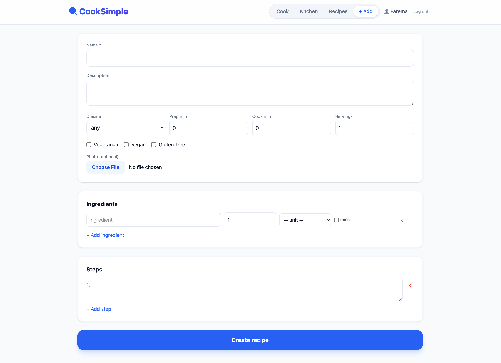

# 🍳 CookSimple

A full-stack recipe manager with smart pantry tracking and ingredient-based recipe suggestions. Built with React + Django REST Framework.

> **Live demo:** _coming soon_ &nbsp;|&nbsp; **Backend API:** _coming soon_

---

## Screenshots

| Recipes | Kitchen / Pantry | Add Recipe |
|---------|-----------------|------------|
|  |  |  |

---

## Features

- **Recipe library** — browse 40+ seeded recipes with cuisine, diet, and time filters
- **Smart suggestions** — see which recipes you can make right now based on your pantry
- **Shopping list** — auto-generate a list of missing ingredients for any recipe
- **Virtual kitchen** — drag ingredients into Fridge, Pantry, or Freezer via a visual grid
  - Same ingredient can live in multiple locations (e.g. some avocados in the fridge, more in the pantry)
  - Warns before adding to a second location; merges quantities within the same location
- **User accounts** — register, log in, and get a personal kitchen + recipe collection
  - Public recipes (seeded by admin) are visible to everyone, read-only
  - Users can create, edit, and delete their own recipes
- **Ingredient autocomplete** — search 150+ common ingredients as you type; add new ones on the fly
- **Image uploads** — attach photos to recipes; stored persistently on Cloudinary
- **Responsive UI** — works on mobile and desktop

---

## Tech Stack

| Layer | Technology |
|-------|-----------|
| Frontend | React 19, Vite, Tailwind CSS |
| Backend | Django 4.2, Django REST Framework |
| Auth | DRF Token Authentication |
| Database | SQLite (dev) → PostgreSQL (production) |
| Image storage | Cloudinary via `django-cloudinary-storage` |
| Deployment | Render (backend) + Vercel/Netlify (frontend) |

---

## Architecture Highlights

- **Ingredient normalization** — ingredients are stored once in a shared `Ingredient` table; recipes and pantry items reference them by FK. This prevents duplicates ("Tomato" vs "tomato") and enables cross-recipe pantry matching.
- **Pantry merge logic** — `PantryItemViewSet.create()` checks for an existing `(ingredient, location, owner)` triple before inserting; matching rows have their quantities added rather than duplicated. The `unique_together` constraint enforces this at the DB level.
- **Per-user data isolation** — `owner=None` recipes are public (seeded by admin). User-owned recipes and pantry items are filtered in `get_queryset()` so users never see each other's data.
- **DRF validator override** — `validators = []` in `PantryItemSerializer.Meta` suppresses the auto-generated `UniqueTogetherValidator` that would reject updates before custom merge logic could run.
- **Cloudinary conditional storage** — `settings.py` falls back to local `MEDIA_ROOT` when `CLOUDINARY_CLOUD_NAME` is not set, so development works out of the box without cloud credentials.
- **Decimal quantities** — recipe and pantry quantities use `DecimalField` (not `FloatField`) to avoid floating-point rounding errors when scaling recipes.

---

## Project Structure

```
cooksimple_project/
├── backend/                  # Django project
│   ├── recipes/
│   │   ├── models.py         # Recipe, Ingredient, Unit, PantryItem, Step
│   │   ├── serializers.py    # DRF serializers with image validation
│   │   ├── views.py          # ViewSets with ownership + auth
│   │   ├── auth_views.py     # Register, login, logout, /me endpoints
│   │   ├── suggest.py        # Pantry-based recipe suggestion engine
│   │   └── management/
│   │       └── commands/
│   │           └── seed_recipes.py   # 40+ recipes + 150 ingredients
│   └── backend/
│       └── settings.py       # Cloudinary, CORS, DRF config
│
└── cooksimple/               # React frontend
    └── src/
        ├── App.jsx            # Main app + routing tabs
        ├── AuthContext.jsx    # Auth state + token management
        ├── api.js             # Typed API client (all fetch calls)
        └── components/
            ├── IngredientGrid.jsx        # Drag-and-drop kitchen
            ├── IngredientAutocomplete.jsx # Debounced ingredient search
            └── AddRecipeForm.jsx          # Multi-step recipe creation
```

---

## API Endpoints

```
POST   /api/auth/register/         Register new user, returns token
POST   /api/auth/login/            Login, returns token
POST   /api/auth/logout/           Invalidate token
GET    /api/auth/me/               Current user info

GET    /api/recipes/               List recipes (public + owned)
POST   /api/recipes/               Create recipe (auth required)
PATCH  /api/recipes/{id}/          Update own recipe
DELETE /api/recipes/{id}/          Delete own recipe
PATCH  /api/recipes/{id}/upload_image/  Attach photo

GET    /api/pantry/                My pantry items
POST   /api/pantry/                Add item (merges if same location)
PATCH  /api/pantry/{id}/           Update quantity/location
DELETE /api/pantry/{id}/           Remove item

GET    /api/ingredients/?search=   Autocomplete search
GET    /api/suggestions/           Recipes I can make now
GET    /api/shopping_list/         Missing ingredients for selected recipes
```

---

## Local Setup

### Backend

```bash
cd backend
python -m venv venv && source venv/bin/activate
pip install -r requirements.txt

cp .env.example .env          # fill in SECRET_KEY (and optional Cloudinary creds)
python manage.py migrate
python manage.py seed_recipes  # seeds 40+ recipes + 150+ ingredients
python manage.py createsuperuser
python manage.py runserver
```

### Frontend

```bash
cd cooksimple
npm install
npm run dev
```

The frontend proxies `/api` to `http://127.0.0.1:8000` via Vite config.

### Environment variables

```
# backend/.env
SECRET_KEY=your-django-secret-key
DEBUG=True

# Optional — images fall back to local storage without these
CLOUDINARY_CLOUD_NAME=
CLOUDINARY_API_KEY=
CLOUDINARY_API_SECRET=
```

---

## Roadmap

- [ ] Deploy to Render + Vercel
- [ ] Recipe editing from the frontend (currently admin-only)
- [ ] Household / family sharing (shared kitchen between accounts)
- [ ] Nutritional info per recipe
- [ ] Meal planning calendar

---

## License

MIT — free to use, fork, and learn from. Attribution appreciated.

---

*Built by [Fatema Alhosein](https://github.com/FatemaAlhosein) as a full-stack portfolio project.*
